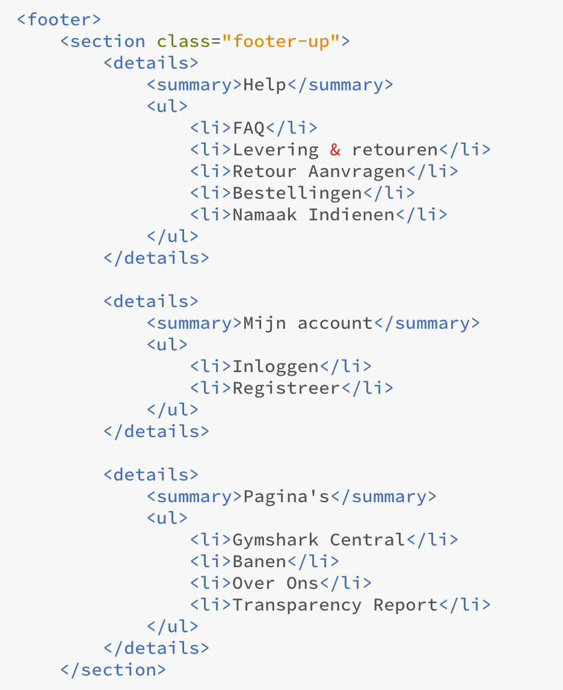
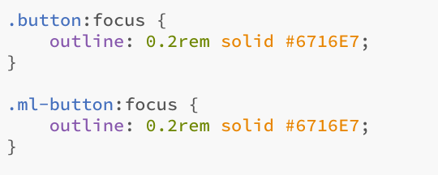
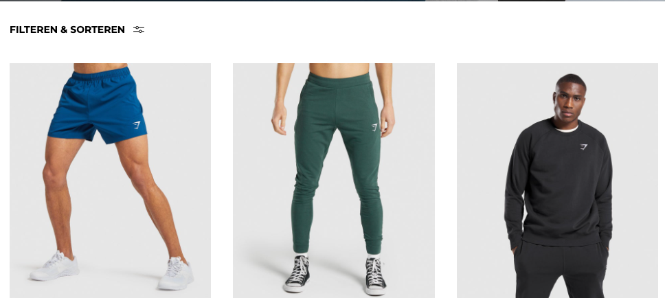
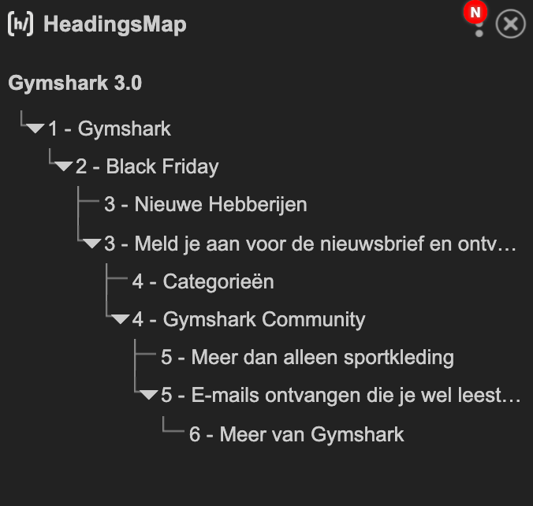

# Procesverslag
Markdown is een simpele manier om HTML te schrijven.  
Markdown cheat cheet: [Hulp bij het schrijven van Markdown](https://github.com/adam-p/markdown-here/wiki/Markdown-Cheatsheet).

Nb. De standaardstructuur en de spartaanse opmaak van de README.md zijn helemaal prima. Het gaat om de inhoud van je procesverslag. Besteedt de tijd voor pracht en praal aan je website.

Nb. Door *open* toe te voegen aan een *details* element kun je deze standaard open zetten. Fijn om dat steeds voor de relevante stuk(ken) te doen.

## Je website

In de eerste week ben ik gaan nadenken over wat voor website ik wilde gaan namaken voor het vak Frontend Development. Ik heb de afgelopen 3 jaar volledig mijn passie omgegooid van voetbal naar fitness. Ik ben van voetbal afgegaan en ben verder gegaan met fitnessen. In de fitness lifestyle dragen veel sport athleten het kledingmerk van 'Gymshark'. Dit is momenteel een van de grootste fitness merkkleding in Europa. Ik ben erg fan van de sportkleding en heb ook meer dan 15 shirts, 5 tanktops, 45 broeken, 8 korte broekjes en zelfs mondkapjes in de stijl van Gymshark. Eigenlijk kan ik wel zeggen dat ik verslaafd ben aan de artikelen van Gymshark. Het werd op een gegeven moment zo erg dat ik continue (elk uur) wel zat te kijken op de site voor nieuwe kleding. Nu leek het mij erg interessant en best moeilijke uitdaging om de website na te programmeren. Ik kan van mezelf zeggen dat ik niet de beste programmeur ben, want ik blijf gewoon een UX-Designer in opleiding. Maar mij leek het zeker een erg leerzame traject voor de komende weken en soms moet je ook een beetje uit je confrontzone te stappen om door te groeien als webdesigner.

### Je opdracht:
https://nl.gymshark.com/

#### Screenshot(s) van de eerste pagina (small screen): 

Home pagina - Black Friday  

#### Screenshot(s) van de tweede pagina (small screen): 

Heren pagina  

#### Screenshot(s) van de eerste pagina (wide screen):

Home pagina - Black Friday   

#### Screenshot(s) van de tweede pagina (wide screen):

Heren pagina   

 

## Toegankelijkheidstest

Aan het einde van het programmeren van mijn website, heb ik een toegankelijkheidstest gedaan. Hieronder vind je alle  bevindingen die in mijn test naar voren kwamen. Uiteindelijk waren dit niet hele grote aanpassingen in mijn website, omdat de meeste regels al goed waren toegepast. Echter waren dit alleen kleine schoonheidsfoutjes die makkelijker te voorkomen waren met de toegankelijkheidstest.

### Bevindingen
Dit is mijn lijst met bevindingen die in de test naar voren kwamen:
1. Zorg ervoor dat er een zichtbare focusstijl is voor interactieve elementen waarnaar wordt genavigeerd via toetsenbordinvoer.
2. Zorg ervoor dat besturingselementen :focusstatussen hebben.
3. Zorg ervoor dat alle img elementen een alt-attribuut hebben.
4. Kopelementen moeten in een logische volgorde worden geschreven.

#### Zichtbare focusstijl voor interactieve elementen
Tijdens de toegankelijkheidstest kwam ik erachter dat niet alle interactieve elementen genavigeerd konden worden via de toetsenbord (tab-key). Als een knop interactief is, dan komt er een gekleurde border om de interactieve knop te staan (de zichtbare focusstijl). Als de interactieve knop niet interactief is, dan wordt deze automatisch overgeslagen. Dit kwam ik tegen in de footer en op de artikelen van de heren. Ik kwam hier namelijk achter toen ik alle interactieve knoppen van mijn website ging vergelijken met die van de echte Gymshark website. 

De interactieve elementen die ik moest oplossen:

Uiteindelijk heb ik alle interactieve knoppen in de footer en op de artikelen een a href geven, zodat de knop doorverwezen kan worden naar een andere pagina. In mijn code heb ik nu alles # gegeven, zodat de gebruiker er wel op kunt klikken. Maar de gebruiker wordt wel naar de bovenkant van de huidige pagina gestuurd. 

Oplossing toegepast:

#### Besturingselementen moeten :focusstatussen hebben 
Focusstatussen zijn erg belangrijk op een website. De zichtbare focusstijlen helpen mensen te bepalen welke interactief element de toetsenbordfocus heeft. Nu merkte ik dat er weinig verschil was tussen linkjes en buttons op mijn website. 

Daardoor heb ik ervoor gekozen om de focus-status kleur bij de knoppen te veranderen. Hierdoor kan er gemakkelijker een onderscheid worden gemaakt van verschillende interactieve elementen. Dit zorgt ervoor dat de gebruiker makkelijker en gebruiksvriendelijker door de website genavigeerd kan worden. Door de focus-kleur te veranderen heb ik alle knoppen met de class "button" de border paars gegeven. Als de gebruiker de volgende keer door mijn website tabt, dan ziet hij het verschil tussen de interactieve elementen. 

Oplossing van de focus-button opgelost:

#### Alle img elementen een alt-attribuut hebben.
Het is belangrijk dat de website toegankelijk is voor iedereen. Mensen die niet goed kunnen kijken of blind zijn worden voor gelezen door een screen-reader. Een screen-reader leest de alt-kenmerk op een afbeelding. Als de afbeelding in de code geen alt-kenmerk bevat, dan weet de blinde gebruiker niet wat er op de website staat vermeld. Nu merkte ik dat ik hier als frontender geen rekening mee had gehouden. 

Uiteindelijk heb ik dit opgelost door achter alle images een alt-tekst neer te zetten met een goed en duidelijke beschrijving van de afbeelding. 

Oplossing van de alt-kenmerk opgelost:

#### Kopelementen in logische volgorde. 

Aan het begin van de lessen heebben we een handige tool gekregen van Joost Faber, namelijk headingsMap. Dit is een tool waardoor je heel gemakkelijk de volgorde van alle kopelementen kunt bekijken. Het is gebaseerd op de diepte van de inhoud wat er op een website staat vermeld. Echter kwam ik erachter dat de headingsmap van de orginiele website van Gymshark totaal niet overzichtelijk was. Er wordt namelijk erg veel gebruik gemaakt van h2 en h3tjes door elkaar heen en het had geen chronolische volgorde. Tijdens het testen kwam ik erachter dat erbij mij op de heren-pagina weinig h-elementen werden gebruikt. 

De code die ik had gekregen van Joost Faber: 

Uiteindelijk heb ik dit opgelost door de code van Joost Faber te gebruiken (.visually-hidden) hiermee kan je h-elementen onzichtbaar maken, terwijl deze dan wel in je headingsMap te zien zijn. Hierdoor kan je heel gemakkelijk structuur aan je website geven en kan de gebruiker zien wat voor informatie er allemaal op de pagina te vinden is.  

Oplossing om H-elementen te voorstoppen: 

## Eindgesprek

De afgelopen jaren ben ik erg gegroeid op het gebied van UI/UX Design. Hierdoor ben ik mezelf echter heel vaak tegen gekomen en daarmee bedoel ik dat ik precies weet hoe ik zelf als designer in elkaar zit. Ik zet met altijd 100% in om tot een goed eindresultaat te komen. De afgelopen maanden ben ik ook bezig geweest UX-stagiaire bij yourdutchmeida. Daar ben ik eigenlijk achter gekomen dat ik erg perfectionisch ben. Als ik een online toepassing ontwerp, dan let ik daadwerkelijk op alles. Ik let op de leesbaarheid van de teksten, de grootte van de interactieve elementen, de hierarchie, de indeling van content, witruimtes, kleurgebruik (contrast) en nog veel meer. Nu wil ik als frontender net zo perfectionisch ter werk gaan. Echter is dit wel een uitdaging, omdat ik natuurlijk een designer blijf. Ook zal mijn uitleg ook niet heel erg sterk zijn, maar ik probeer het zo goed mogelijk te formuleren. In de afgelopen weken heb ik erg veel tijd gestoken in deze website en als ik niet verder kwam hulp gevraagd aan Marvin (medestudent op CMD). Hieronder ga ik beschrijven wat er in mijn website erg goed ging en wat ik erg lastig vond aan de hand van een aantal screenshots. 

### Stand van zaken
In de eerste weken kwam ik er al eigenlijk best snel achter dat de website van Gymshark best ingewikkeld gecodeerd is. Dit zal je uiteindelijk ook terug lezen in mijn 'stand van zaken', omdat niet alles precies is overgenomen wat er op de echte website te zien is. Uiteindelijk mag het ook iets afwijken van de oorspronkelijke website, echter ben ik zo perfectionisch dat ik toch door blijf zetten om de website zo goed mogelijk na te ontwikkelen (coderen). 

#### Wat ging er minder goed?
1. De structuur van de nav veranderen tijdens het responsive maken.
2. De footer responsive maken. 
3. Menu + Filter met javascript.

##### De navigatie van Gymshark: 

Op de website van Gymshark gebruiken ze een nav die bij een width van 990 pixels van structuur veranderd. Wat er gebeurt met de nav is dat de logo gecentreerd in het midden wordt gezet. De navigatie menu (Dames, Heren & Black Friday) wordt het hamburger-menu en wordt gecentreerd aan de linkerkant. Naast de hamburger-menu komt de search-icon te staan, en de gebruikers-icon wordt ook in het hamburger-menu gezet. Alleen de wishlist en de winkelwagen blijven rechts gecentreerd staan.

Ik heb hierbij hulp gevraagd van Marvin, omdat hij precies wist hoe je items in een bepaalde container met elkaar kunt omwisselen. Hij had deze bron aan mij gegeven (bron: https://developer.mozilla.org/en-US/docs/Web/CSS/order). Na ongeveer een halfuurtje begreep ik ongeveer wat de code deed. De code 'order' pakt een item uit een container en verwisseld het met een andere item. Deze items worden in een container gesorteerd op eenlopende waarde en vervolgens op de nummer 1,2,3,4 etc... (bekijk de bron). Echter is order alleen bedoeld voor de visuele volgorde om elementen te beïnvloeden, het mag niet gebruikt worden op niet-visuele media zoals spraak. De hamburger-menu had ik eerst op display:none gezet, maar bij een waarde van 990 pixels wordt het display:block en order 1. 

Opgelost met deze code: 

Uiteindelijk heb ik ervoor gekozen om de gebruikers-icon niet in de navigatie te plaatsen, omdat deze al in de top-bar is aangegeven. Als ik het kijk vanuit het oogpunt van een designer bekijk, is het onnodig om 2 dezelfde functionaliteiten dichtbij elkaar neer te zetten. Dit is onnodig en is niet goed bij nagedacht = less is more. Uiteindelijk heb ik de css code 'order' gebruikt om een item in een container te sorteren op een oplopende waarde. Ook heb ik ervoor gekozen om de search-icon bij de wishlist en winkelwagen te houden. Hierdoor staan alle linkjes aan dezelfde kant en blijft het consistent. 

Eindresultaat: 

##### De footer responsive maken:

Om heel eerlijk te zijn was dit de moeilijkste opdracht van de hele website. Hier zal mijn uitleg niet heel erg sterk zijn, maar daarvoor ben ik een student en mag ik fouten maken. Marvin had het ook een aantal keer uitleg wat ik fout deed en hoe we het uiteindelijk hadden opgelost. Wat de footer zo moeilijk maakte, was dat de footer bestaat uit veel verschillende elementen. Daarnaast moesten deze elementen op verschillende manieren omgewisseld worden met de code 'order'. Ik heb dagen geprobeerd om dit op te lossen, maar om eerlijk te zijn was dit niet alleen gelukt. Al eerder had ik aan Joost Faber gevraagd of het mag om meerdere footers te maken voor verschillende devices en dat je ze dan op display:block zet als van waarde veranderen. Uiteindelijk mocht dit niet, dus heb ik er eerst voor gekozen om een eigen footer te maken. Dit is uiteindelijk een simpele footer gemaakt met alleen de linkjes en de slider (figuur 1). Dit was overigens niet heel moeilijk om te maken, omdat ik alles onder elkaar had gezet. De footer bevat niet alle content, maar het ziet er wel strak uit! 

Figuur 1 - Simpele footer:

Wat ik dan wel weer makkelijk vond, was een slider op mobiele versie responsive maken. Ik heb dit gedaan door de slider een max-width te geven van 47rem en een overflow-x: scroll functie te geven. Als het scherm dan een kleiner width krijgt dan 47rem, dan ontstaat er een horizontale scroll-bar, waardoor de items die buiten het scherm vallen (naast het scherm) worden gezet. Hierdoor kan de gebruiker de items naar links swipen om alle items te kunnen zien (bekijk figuur 2). 

Figuur 2 - Slider responsive:

Ik vertelde al eerder dat ik als webdesigner erg perfectionisch ben, daarom wilde ik graag met behulp van Marvin de footer responsive maken op de manier waarop Gymshark dat ook heeft gedaan. We zijn gestart bij het scherm die bij 1000px (62,5rem) groot is gebruiken we een media query die de footer op flex zet. Daardoor komen alle elementen naast elkaar te staan. Vervolgens door flex-wrap komen de elmenten die niet breedt passen op de volgende regel te staan. De order passen we aan, zodat de elementen in de juiste volgorde komen te staan. De .bankieren en .social secties geven we een breedte van 50% - de gap. Hierdoor vullen ze samen een hele rij en komt de rest automatisch ook op een nieuwe rij te staan. 

Met behulp van Javascript kijken we naar de schermbreedte bij initialization en wanneer het scherm veranderd van grootte. Als het scherm groter is dan 62,5rem klappen we de details uit, zodat de tekst zichtbaar wordt. Uiteindelijk is de footer niet 100% identiek, maar het komt heel erg dicht in de buurt. Daarbij mocht de eigen gemaakte footer ook een beetje afwijken van de oorspronkelijke footere. 

Figuur 3 - Footer 2.0-web:

Figuur 4 - Footer 2.0-mobiel:

###### Menu + Filter met javascript

Een belangrijke criteria was dat er ook nog een micro-interactie moest komen op de website. Daarom heb ik ervoor gekozen om met behulp van een EventListener de micro-interactie ontwikkeld. Op WW3-schools had ik opgezocht hoe je ook alweer een EventListener moest aanroepen om een specifieke actie te laten doen. Uiteindelijk na een halfuurtje, was het gelukt om de hamburger-menu te openen. Dit heb ik gedaan door de addEventListener de waarde 'click' te geven en de functie 'openMenu' te geven (deze twee waardes heb ik ook gekoppeld aan de class in het HTML-bestand). In de eerste hebben we dit geleerd bij het vak inleiding programmeren en tijdens mijn minor had ik er nog een lesje in gehad, waardoor ik wist hoe je deze code in javascript moest zetten. Verder heb ik de knoppen uit de filter een :hover gegeven, waardoor de gebruikers weten dat deze knoppen interactief zijn. Echter heb je niet zoveel aan een hover op een mobiele versie, dus heb ik ervoor gekozen deze filters display:none te geven bij een width van 62.5rem. Ik heb de knop 'filteren&sorteren' op display: block gezet, maar heb ik niet uitgewerkt in een micro-interactie. Dit was voor mij persoonlijk een te grote opgave en uiteindelijk hoefde we ook niet alles aanklikable te maken. (bekijk figuur 5). Echter als ik hier nog 10 weken extra aankon werken had ik het wel geprobeerd om deze micro-interactie uit te werken. Maar de footer nam teveel tijd in en naast dit vak heb ik het ook druk met stage (5 dagen in de week) en de voorbereiding op mijn scriptie. Natuurlijk heb ik wel aan de criteria van dit vak gehouden en vond ik dit zeker erg leuk om te doen. Vooral de kick als een code werkt, is echt een top gevoel! Alleen toch blijft mijn liefde groter voor design.

Figuur 5 - Filter&Sorteren:

Uiteindelijk vond ik het niet heel lastig om het menu en filter te maken. Dit kwam doordat ik nog precies wist hoe je een EventListener moet aanroepen om een specifieke actie te laten doen. Door een addEventListener de waarde 'click' te gegeven en de functie 'openMenu' te gegeven (ook in HTML), wordt de hamburger-menu & filter optie geopent als de gebruiker hierop klikt. Dit zie je ook terug op mijn website. Uiteindelijk was dit niet heel moeilijk om te regelenDit is niet moeilijk, maar het was wel nog de enige functie die ik hoefde te gebruiken. Uiteindelijk wist ik dit nog doordat ik tijdens mijn minor les heb gehad over de addEventListener en daardoor wist hoe ik de regels moest gebruiken. Verder heb ik nog bij de knoppen van de filter een hover gegeven, zodat de gebruiker weet dat deze interactieve elementen zijn en hierop de artikelen kan filteren. Zie figuur 5 en 6 voor het eindresultaat.

Figuur 5 - Menu 

Figuur 6 - Filter

#### Wat ging er wel goed:
1. HTML schrijven met behulp van sections, zonder divjes. 
2. Headermap
3. Het toepassen van rem i.p.v pixels. 
4. Alle interactieve elementen werkbaar maken. 
5. Artikelen responsive maken met behulp van flex en wrap. 

Ik vind dat ik erg trots mag zijn op het eindresultaat van de website van 'Gymshark'. Ik vind persoonlijk dat mijn website erg veel lijkt op de oorspronkelijk website. De afgelopen weken ben ik hierdoor ook erg druk geweest om de website zo goed en gebruiksvriendelijk mogelijk na te ontwikkelen. 

##### HTML schrijven zonder divjes: 

In de eerste 2 weken heb ik na langer dan een jaar weer voor het eerst geprogrammerd. Echter had ik direct tijdens de eerste feedbacksessie met Joost Faber op mijn kop gekregen omdat ik divjes had gebruikt. Dit mocht namelijk niet, want dat is niet semantisch correct! Echter wordt dit wel vaker toegepast in de echte wereld, want mijn stage bedrijf en veel andere website (ook Gymshark) maken veel gebruik van divjes. Maar goed dit was 1 van de criteria, waar je aan moest voldoen. Uiteindelijk kreeg ik van Joost Faber een voorbeeld te zien van een HTML structuur (bron: https://codepen.io/joostf/pen/MOxQex). Hierdoor heb ik mijn hele HTML structuur veranderd en ben ik daarop verder gaan programmeren. In figuur 8 is mijn oude structuur te zien en figuur 9 is mijn oplossing te vinden. 

Figuur 7 - Oude structuur met divjes

Figuur 8 - Nieuwe structuur 

##### Headingsmap: 

Een headingmap is handig om de structuur van je pagina's te bekijken, waardoor je de toegankelijkheid kan je website kan evalueren. Daarbij kan je ook zien wanneer er een kop ontbreekt. Die toont de plug-in aan met een rode markering. Vooral voor mensen die blind zijn is dit een handige methode om met behulp van een screenreader de structuur van je website te lezen. In figuur 9 en 10 zie je de structuren van beide pagina's. 

Figuur 9 - Black Friday 

Figuur 10 - Heren pagina

###### Alle interactieve elementen werkbaar maken

Om een interactief element werkbaar te maken moet je deze items a href geven. Dit zorgt ervoor dat je met behulp van de toetsenbord erachter kunt komen welke knoppen interactief zijn. Op mijn website is dit terug te zien dat alle linkjes en knoppen werken. De knoppen heb ik uiteindelijk de kleur paars gegeven om een onderscheid te maken, met de interactieve linkjes. De linkjes in de nav, filter, artikelen en footer heb ik een donker grijze border. Ook moesten alle interactieve knoppen een :focus hebben en dit heb ik getest in de toegankelijkheidstest.  

###### Artikelen (producten) responsive maken:

Figuur 11 - 4 kolommen producten 

Wat ik vooral makkelijk vond te doen was de meeste elementen responsive maken in 3 verschillende breakpoints. Daarnaast had ik ook al redelijk snel door hoe display: flex, flex-wrap:wrap, justify-content, text-align in zijn algemeen werken. Hierdoor kon ik eigenlijk heel gemakkelijk de grote hero's coderen en responsive maken. Verder vond ik het ook niet heel lastig om de producten responsive te maken. Als het scherm bij een width van 62,5rem gebruiken media query die alle artikelen op flex zet. Vervolgens door flex-wrap te gebruiken komen de artikelen die niet in de breedte (kader) passen op de volgende regel te staan. En vervolgens hebben we artikels bij de eerste media query een width gegeven van 33.333%, dit zorgt ervoor dat er 3 artikelen in 1 rij komen te staan. Vervolgens bij een media query van 44rem heb ik de width veranderd naar 50%, waardoor er 2 artikelen in dezelfde rij komen te staan. Als laatste deed ik hetzelfde met de 3e breakpoint, alleen heb ik deze dan een width van 100% gegeven. Dit zorgt ervoor dat alle artikelen onder elkaar worden gezet. 

Figuur 12 - 3 kolommen producten

Figuur 13 - 2 kolommen producten

Op de oorspronkelijke website van Gymshark maken ze gebruiken van een kolommen verhouding van 5 | 4 | 3 | 2. Ik heb er uiteindelijk voor gekozen om de kolommen te verdelen over 4 | 3 | 2 | 1, dit komt mijn website pas responsive wordt vanaf 62,5rem, dan 44rem en daarna 29rem. Door uiteindelijk 1 artikel op een regel te zetten gaat er meer focus (aandacht) naar 1 specifiek product, het enige nadeel is dat gebruikers langer moeten scrollen door de website. Maar dat betekent niet direct dat het minder gebruiksvriendelijk is, omdat je alle artikelen nog steeds makkelijk kunt vinden. 

Figuur 12 - 1 kolom 

### Screenshot(s) van de eerste pagina: 

Home pagina - Black Friday - mobiel 

Home pagina - Black Friday - desktop

#### Screenshot(s) van de tweede pagina: 

Heren pagina  

Heren pagina   

 

## Bronnenlijst

continu bijhouden terwijl je werkt

Nb. Wees specifiek ('css-tricks' als bron is bijv. niet specifiek genoeg).

1. Headersmap - https://chrome.google.com/webstore/detail/headingsmap/flbjommegcjonpdmenkdiocclhjacmbi?hl=en
2. Voorbeeld van de juiste structuur met HTML - https://codepen.io/joostf/pen/MOxQex
3. Hoe ik sections heb gebruikt in mijn HTML - https://css-tricks.com/how-to-section-your-html/
4. Het maken van een structureel overzicht met behulp van headings - https://web.dev/headings-and-landmarks/
5. Micro-interacties - https://css-tricks.com/video-screencasts/150-hey-designers-know-one-thing-javascript-recommend/
6. Verschillende hover:states - https://css-tricks.com/so-many-states/
7. Uitleg over wat een micro-interactie is - https://www.youtube.com/watch?v=HZHHBwzmJLk&feature=youtu.be
8. Focus states - https://css-tricks.com/focusing-on-focus-styles/
9. Alle tips en tricks over flex-box - https://css-tricks.com/snippets/css/a-guide-to-flexbox/
10. Media queries & flexbox & grid layout & microinteraction https://codepen.io/joostf/pen/MOxQex 
11. De visuele volgorde van elementen te beïnvloeden - gebruikt in de nav-bar: https://developer.mozilla.org/en-US/docs/Web/CSS/order
12. Schuift de elementen onder elkaar met dezelfde witruimte, als de beeldresolutie veranderd: https://www.w3schools.com/css/css3_flexbox_container.asp
13. Zorgt voor witruimte tussen rijen en kolommen in een raster, flex en meerkolomslayouts: https://css-tricks.com/almanac/properties/g/gap/
14. CSS-tricks hulp met verschil tussen em en rem: https://css-tricks.com/confused-rem-em/
15. Het bouwen van een responsieve navigatiebalk en hamburgermenu bouwen met HTML, CSS en Javascript: https://dev.to/devggaurav/let-s-build-a-responsive-navbar-and-hamburger-menu-using-html-css-and-javascript-4gci
16. Het verbergen van content: https://www.a11yproject.com/posts/how-to-hide-content/
17. Dan align je de items vanaf de baseline van de parent - https://css-tricks.com/almanac/properties/a/align-items/
18. Wat is precies Gap en hoe ga je dit toepassen in je website - https://developer.mozilla.org/en-US/docs/Web/CSS/gap
19. Hoe gebruik je addEventListener met Javascript - https://www.w3schools.com/jsref/met_document_addeventlistener.asp
20. Responsive maken van een website met behulp van media query - https://www.w3schools.com/cssref/css3_pr_mediaquery.asp
21. Wat is en hoe gebruik je justify-content baseline - https://www.smashingmagazine.com/2012/12/css-baseline-the-good-the-bad-and-the-ugly/
22. Hoe geef je een tweede of derde element een andere kleur - https://www.w3schools.com/cssref/sel_nth-of-type.asp
23. Het verstoppen van de headings met behulp van .visual hidden - https://www.a11yproject.com/posts/how-to-hide-content/

